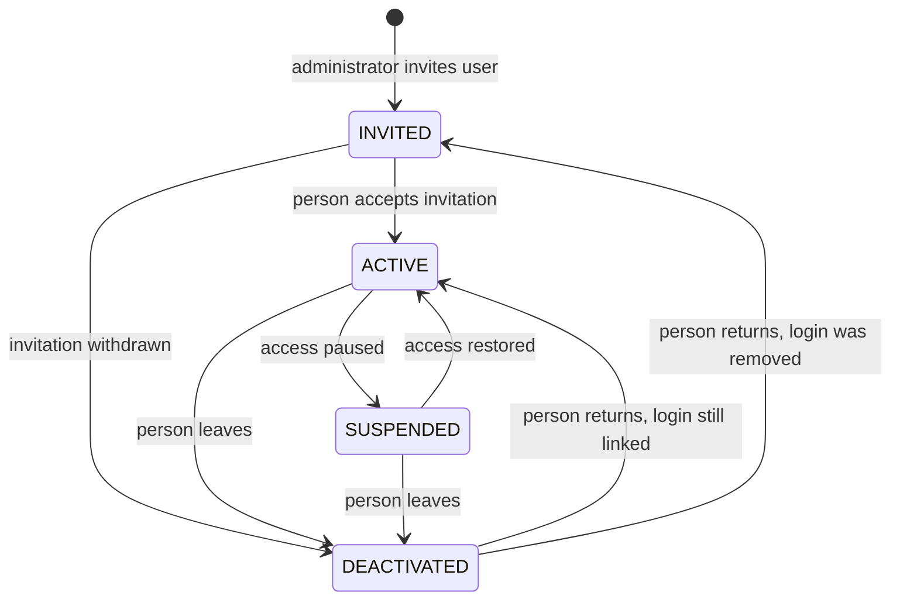

# User Model

| | |
|---|---|
| **Epic** | Identity & Access Management, Auth & Auth |
| **Story** | Maintain a business identity for each user |
| **Status** | Revised after review; ready for persistence |
| **Date** | 2026-10-07 |
| **Deliverable** | Documented application-user model, ready for persistence |

## 1. Purpose

Fuel ERP must be able to tie every action to a known person. Authentication alone does not give us that: it proves that someone controls a login, not who that person is within the business.

This document defines the **Application User**: the record that represents a person inside Fuel ERP, how it relates to the authentication identity, its lifecycle, its role requirement, and the identifier the rest of the system will reference.

**MVP scope:** one organization running two gas stations. The MVP will be presented to the owners. Multi-organization support is out of scope and is expected to arrive later, possibly on a different stack.

## 2. Two identities, two owners

| | Authentication identity | Application user (business identity) |
|---|---|---|
| Answers | "Is this login genuine?" | "Who is this person in the company, and may they use Fuel ERP?" |
| Owner | Supabase Auth (`auth.users`) | Fuel ERP (`public.users`) |
| Holds | Auth ID, login email, credentials, email confirmation, sessions, last sign-in | Name, status, role, audit trail, later station assignments |
| Example | `abc-123`, `francis@example.com` | Francis Kato, Administrator, ACTIVE |
| Changed by | The person (password reset) or Supabase | An administrator, through Fuel ERP |

**Rule:** Fuel ERP never stores or handles credentials. Supabase Auth never decides what a person may do in the business.

## 3. Decisions

| # | Decision | Reason |
|---|---|---|
| D1 | The application user has its own primary key (`id`, UUID), separate from the Supabase Auth ID. | Business records must survive a change of auth provider, a recreated login, or a user who exists before/after having a login. |
| D2 | Every business record references `users.id`. Nothing outside the IAM module references the auth ID. | One stable identifier for "who did this". |
| D3 | The link to authentication is one column, `auth_user_id`, unique and nullable. | One person, at most one login. Nullable so a user can be provisioned before sign-up and retained after their login is removed. |
| D4 | Credentials, email verification and last sign-in are not stored on the application user. | Supabase Auth already owns them (`auth.users.email_confirmed_at`, `auth.users.last_sign_in_at`); a second copy is a liability and will drift. |
| D5 | Lifecycle is an explicit `status` with four values and defined transitions. | Access control needs a single, unambiguous answer to "may this person use the system right now?" |
| D6 | Users are never hard-deleted. | Historical sales, banking and fuel records must always resolve to a person. |
| D7 | Exactly one role per user in v1, required. | Meets "controlled access" without enterprise IAM; extends cleanly later (section 8). |
| D8 | Single organization in the MVP; no `organization_id` column. | Only one business (two stations) uses the MVP. Adding tenancy now is cost with no user. |
| D9 | Business rules are enforced **in the database**, not in application code (section 9). | See section 4.1. |
| D10 | When a login is linked, the login email is the source of truth; the database copies it onto the application user. | Keeps the two emails identical without relying on the app to remember. |

## 4. Access rule

A request is allowed into Fuel ERP only when **all** of these hold:

1. Supabase Auth presents a valid session.
2. Exactly one application user has `auth_user_id` equal to the session's auth ID.
3. That application user's `status` is `ACTIVE`.

A valid login with no application user, or with a non-active one, is authenticated but **not authorized** and is refused.

This check runs on **every request**, not only at sign-in. A status change therefore takes effect immediately, even for someone who is already signed in. It will be implemented with row-level security policies (access-control story) so it applies to every query against the data.

### 4.1 Why the rules live in the database

The people whose data Fuel ERP holds (station owners, managers, attendants) need a guarantee that does not depend on every line of application code being correct.

| | Rules in the database (chosen) | Rules in server code using the service-role key |
|---|---|---|
| Applies to | Every way the data is reached: the web app, scripts, the Supabase dashboard API, a bug in the app | Only requests that go through that server code |
| If the app has a bug | The database still refuses the bad change | The bad change goes through |
| If a key leaks | A leaked user session can do only what that user is allowed to do | The service-role key bypasses all protections; everything is exposed |
| Who is recorded as making the change | Set by the database from the session; cannot be forged by the client | Whatever the server code writes |

How keys are used as a result:

- The web app talks to Supabase **as the signed-in person**, using their session. Row-level security and the rules in section 9 decide what they may do.
- The service-role key is kept **server-side only** (never in the browser, never in a `NEXT_PUBLIC_` variable) and is used **only** for Supabase Auth administration that has no alternative: sending an invitation and removing a login. It is never used to read or write business data.

## 5. Field specification

Table: `public.users`

| Column | Type | Null | Default | Notes |
|---|---|---|---|---|
| `id` | `uuid` | no | `gen_random_uuid()` | Primary key. Stable internal identifier. Never changes, never reused. |
| `auth_user_id` | `uuid` | yes | | FK to `auth.users(id)`, unique. The only link to authentication. |
| `email` | `citext` | no | | Unique, case-insensitive. While a login is linked, copied from the login email by the database (D10). |
| `first_name` | `text` | no | | Not blank. |
| `last_name` | `text` | no | | Not blank. |
| `status` | `text` | no | `'INVITED'` | One of `INVITED`, `ACTIVE`, `SUSPENDED`, `DEACTIVATED`. |
| `role` | `text` | no | | One of the v1 roles (section 7). |
| `created_at` | `timestamptz` | no | `now()` | Immutable. |
| `updated_at` | `timestamptz` | no | `now()` | Set by the database on every change. |
| `created_by` | `uuid` | yes | | FK to `users(id)`. Set by the database from the session. Null only for system/bootstrap records (e.g. the first administrator). Immutable. |
| `updated_by` | `uuid` | yes | | FK to `users(id)`. Set by the database from the session. Null when the change was made by the system. |

### Changes from the table as it exists today

Current definition (2026-10-07):

```sql
create table public.users (
  id uuid not null default gen_random_uuid (),
  email character varying null,
  password character varying null,
  first_name character varying null,
  last_name character varying null,
  status character varying null,
  email_verified boolean null,
  created_at timestamp with time zone null,
  updated_at timestamp with time zone null,
  created_by uuid null,
  updated_by uuid null,
  constraint users_pkey primary key (id)
);
```

| Column | Today | Target | Why |
|---|---|---|---|
| `id` | `uuid`, PK, default `gen_random_uuid()` | Unchanged | Already correct. |
| `auth_user_id` | *missing* | **Add**: `uuid`, unique, FK to `auth.users` | The relationship this story asks for. |
| `email` | `varchar`, nullable, not unique | `citext`, not null, unique, format check | One person per email; case-insensitive matching. |
| `password` | `varchar` | **Remove** | Credentials belong to Supabase Auth only (D4). |
| `email_verified` | `boolean` | **Remove** | Owned by Supabase Auth (D4). |
| `first_name`, `last_name` | `varchar`, nullable | `text`, not null, not blank | Every user is a named person. |
| `status` | `varchar`, nullable, any value | `text`, not null, default `'INVITED'`, four allowed values | Single answer to "may this person sign in?" |
| `role` | *missing* | **Add**: `text`, not null, allowed values | Role requirement (section 7). |
| `created_at`, `updated_at` | nullable, no default | Not null, default `now()`, maintained by the database | Reliable audit timestamps. |
| `created_by`, `updated_by` | `uuid`, no FK | Self-referencing FKs, set by the database | Audit columns must point at a real user and cannot be forged. |

Existing data, checked 2026-10-07 (Q3):

- No null emails and no duplicate emails, so the `not null` and `unique` constraints can be applied as is.
- The only `status` value in use is `ACTIVE`, which is valid in the target model.
- One row had a value in `password`. It is treated as exposed, and the column is dropped immediately, ahead of the persistence migration. If the person reuses that password elsewhere, it should be changed there.

Because data exists, the persistence story **alters** the table rather than recreating it.

The table holds one row, inserted only to test the table; it has no Supabase login and no business records. The persistence migration deletes it. D6 (no hard deletes) applies to real users from go-live onward, not to test data.

**First administrator:** the migration inserts them as the system: role `ADMINISTRATOR`, status `INVITED`, `created_by` null. They are then invited from the Supabase dashboard (Authentication → Users → Invite). On acceptance, the triggers in 9.3 link the login and make them the first `ACTIVE` administrator.

## 6. Lifecycle



| Status | Meaning | Can use Fuel ERP? | Login linked? |
|---|---|---|---|
| `INVITED` | Created by an administrator; person has not yet accepted. | No | Optional (usually linked at invitation, see below) |
| `ACTIVE` | Normal working state. | Yes | Required |
| `SUSPENDED` | Temporarily blocked (investigation, leave, missed handover). Expected to return. | No | Required |
| `DEACTIVATED` | No longer with the business. Record kept for history. | No | Optional |

Rules:

- Only an active administrator changes status. A user cannot change their own status.
- Any transition not shown in the diagram is rejected.
- A returning user goes back to `ACTIVE` only if their login is still linked. If it was removed, they go back to `INVITED` and receive a new invitation.
- Suspension and deactivation take effect on the person's next request, because status is checked on every request (section 4). Revoking their Supabase sessions is clean-up, not the control.
- A login may only be removed from Supabase after the user is `DEACTIVATED` or still `INVITED` (the `users_login_required` constraint enforces this).
- The organization must always have at least one `ACTIVE` administrator. The last one cannot be suspended, deactivated or have their role changed.

**Invitation flow (MVP):** the administrator enters name, email and role. Fuel ERP creates the application user as `INVITED` and asks Supabase to send its invitation email. That creates the login, and the database links it to the application user (9.3). The person clicks the link and sets a password. The database then moves them to `ACTIVE` (9.3). The flow's screens are built in a later story.

## 7. Role requirement

- Every user has exactly one role. A user cannot exist without one.
- Role is assigned at creation and changed only by an active administrator.
- Role describes *what kind of work* the person does. It does not yet say *where* (station scoping comes later, section 8).

v1 role values:

| Role | Status | Intent |
|---|---|---|
| `ADMINISTRATOR` | Confirmed (named in the story) | Manages users and has full access. |
| `MANAGER` | Placeholder, kept for MVP | Runs a station; reviews and approves daily records. |
| `ATTENDANT` | Placeholder, kept for MVP | Records day-to-day operational entries. |

Only `ADMINISTRATOR` is required to complete this epic. `MANAGER` and `ATTENDANT` remain placeholders until the role catalogue is confirmed with the owners; changing them later is an ordinary migration (section 9 notes).

## 8. What the model must support later (not built now)

| Future need | How this model accommodates it |
|---|---|
| Station assignment ("Shell Nasuuti") | New table `user_station_assignments(user_id, station_id, ...)` referencing `users.id`. No change to `users`. |
| Different role per station, or multiple roles | Move `role` into the assignment table or a `user_roles` table; `users.role` becomes the default or is retired. |
| Granular permissions | `roles` and `role_permissions` tables keyed on the same role codes. |
| Status history / audit log | Separate audit table keyed on `users.id`; `updated_by` and `updated_at` cover v1. |
| Multiple organizations | Out of MVP scope (D8). Would add an organization link to users and stations and scope email uniqueness per organization. |
| Changing auth provider or adding SSO | Only `auth_user_id` is affected (D1, D2). |

## 9. Target schema

Implemented in [`supabase/migrations/20261007200000_application_users.sql`](../../supabase/migrations/20261007200000_application_users.sql), which alters the existing table (Q3). Tests: [`supabase/tests/users.test.sql`](../../supabase/tests/users.test.sql).

```sql
create extension if not exists citext;

create table public.users (
  id             uuid primary key default gen_random_uuid(),
  auth_user_id   uuid unique references auth.users (id) on delete set null,
  email          citext not null unique,
  first_name     text not null,
  last_name      text not null,
  status         text not null default 'INVITED',
  role           text not null,
  created_at     timestamptz not null default now(),
  updated_at     timestamptz not null default now(),
  created_by     uuid references public.users (id) on delete restrict,
  updated_by     uuid references public.users (id) on delete restrict,

  constraint users_first_name_not_blank check (length(btrim(first_name)) > 0),
  constraint users_last_name_not_blank  check (length(btrim(last_name)) > 0),
  constraint users_email_format         check (email ~ '^[^@\s]+@[^@\s]+\.[^@\s]+$'),
  constraint users_status_valid         check (status in ('INVITED', 'ACTIVE', 'SUSPENDED', 'DEACTIVATED')),
  constraint users_role_valid           check (role in ('ADMINISTRATOR', 'MANAGER', 'ATTENDANT')),
  -- A user who can (or is expected to again) sign in must have a linked login.
  constraint users_login_required       check (status not in ('ACTIVE', 'SUSPENDED') or auth_user_id is not null),
  constraint users_updated_after_created check (updated_at >= created_at)
);

create index users_status_idx on public.users (status);

alter table public.users enable row level security;
-- Policies are defined in the access-control story. With RLS enabled and no
-- policies, the table is closed to client roles by default.
```

Notes on the constraints:

- `on delete set null` with `users_login_required` means Supabase will refuse to delete a login that still belongs to an `ACTIVE` or `SUSPENDED` user. Deactivate first, then remove the login.
- `status` and `role` use `text` with check constraints rather than Postgres enums so values can be added in an ordinary migration.

### 9.1 Rules enforced by database triggers

These rules cannot be expressed as column constraints, so they are enforced by triggers on `public.users` (D9). The SQL is in the migration above; this is the specification it meets.

**Who is acting.** The acting user is the application user whose `auth_user_id` equals the session's `auth.uid()`. When there is no session (migrations, the first-administrator seed, Supabase dashboard SQL), the change is made by the **system**.

| # | Rule | Applies to |
|---|---|---|
| T1 | Inserting or updating a user requires the acting user to be an `ACTIVE` `ADMINISTRATOR`. | Sessions (system exempt) |
| T2 | Users created by an administrator start as `INVITED`. Only the system may insert another status (first-administrator seed). | Sessions |
| T3 | Status changes must follow the transitions in section 6. | Everyone, including system |
| T4 | An administrator cannot change their own `status` or `role`. | Sessions |
| T5 | A change that would take away the last `ACTIVE` `ADMINISTRATOR` is rejected. | Everyone, including system |
| T6 | `id`, `created_at` and `created_by` never change. | Everyone |
| T7 | `created_by` (on insert), `updated_by` and `updated_at` are set by the database; values supplied by the client are ignored. | Everyone |
| T8 | While a login is linked, `email` cannot be edited directly; it follows the login email (9.2). When a login is first linked, `email` must equal the login email. | Everyone except the email sync |

### 9.2 Email sync

A trigger on `auth.users` copies a changed login email onto the linked application user (`after update of email`). This is the only path that changes `email` while a login is linked (T8). The email is confirmed by Supabase before the change reaches `auth.users`, so the application user only ever receives a verified address.

### 9.3 Linking and activation

Two triggers on `auth.users` run as the **system**. As a result, linking and activation never need the service-role key to write to `public.users` (section 4.1) and never conflict with T1 or T4.

| Event on `auth.users` | Effect on `public.users` |
|---|---|
| A login is created (`after insert`), e.g. by an invitation | Links it to the `INVITED` user with the same email that has no login yet. If no such user exists, nothing is linked, and the login has no access (section 4). |
| The person accepts the invitation (`email_confirmed_at` goes from null to set) | Moves the linked user from `INVITED` to `ACTIVE`. Users in any other status are not changed. |

Sign-ups that were not invited never match an `INVITED` user, so they never gain access. Public sign-up should also be disabled in Supabase Auth.

## 10. Out of scope for this story

- Applying the migration and writing the trigger SQL (next story: persistence).
- Invitation and sign-in flows.
- RLS policies and permission checks.
- Station assignments and the station model.
- Audit log of user changes.
- Multiple organizations.

## 11. Open questions and resolutions

| # | Question | Resolution |
|---|---|---|
| Q1 | Is Supabase Auth the authentication provider? | **Resolved:** yes. `password` and `email_verified` are removed. |
| Q2 | What is the v1 role catalogue beyond Administrator? | **Open:** `MANAGER`, `ATTENDANT` kept as placeholders for the MVP. |
| Q3 | Does the existing `users` table contain data that must be kept? | **Resolved:** no. The one row is test data and is deleted by the migration (section 5). |
| Q4 | May the application user email differ from the login email? | **Resolved:** no. Synced by the database (D10, 9.2). |
| Q5 | How is the first administrator created? | **Resolved:** inserted by the migration as `ADMINISTRATOR` / `INVITED`, invited from the Supabase dashboard, and activated by the database on acceptance (section 5, 9.3). Seeded as Francis Kato (fkato1@umbc.edu). |
| Q6 | One organization or many? | **Resolved:** one organization, two stations, for the MVP (D8). |
| Q7 | Where are business rules enforced? | **Resolved:** in the database (D9, section 4.1). |
| Q8 | How are users onboarded? | **Resolved for MVP:** Supabase invitation email (section 6). Supabase's built-in email sender is rate-limited; a custom SMTP sender should be configured before demonstrating invitations to the owners. |

## 12. Acceptance checklist

- [x] Application user is defined separately from the authentication identity (sections 2, 3).
- [x] Relationship to the authentication identity is defined: `auth_user_id`, unique, nullable (D3).
- [x] Stable internal identifier is defined (`id`) and is the only user reference used by business records (D1, D2).
- [x] Lifecycle statuses and allowed transitions are defined (section 6).
- [x] Role requirement is defined: exactly one, required (section 7).
- [x] Field types, nullability, defaults and constraints are specified (sections 5, 9).
- [x] Differences from the current table are listed (section 5).
- [x] Open questions are recorded with their resolution (section 11).
